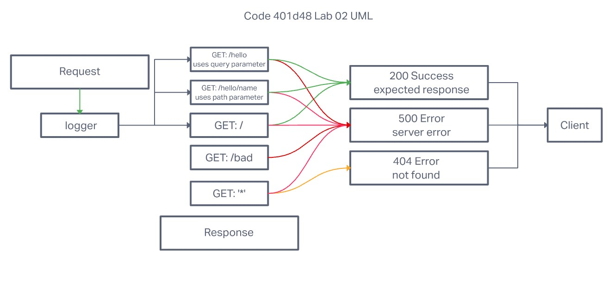

# Project: Basic Express Server

## Author: Robert Ball

### Code 401d48 Lab 02

### Problem Domain

* From a business requirements standpoint, we will be building a basic Express server using best practices, including server modularization, use of middleware, and tests.

Deployed production server: [Heroku - RDBALL Basic Express Server](https://rdball-basic-express-server.herokuapp.com/)

---
Requirements:

* Capture a users search query on a designated route 

```html
.../person?name=query
```

* return a JSON obj with the format

```json
{"name": "query" }
```

* Include testing to assert the following:
  * 404 on a bad route
  * 500 if no name in the query string
  * 200 if the name is in the query string
  * given an name in the query string, the output object is correct

Documentation:



Dependencies

* `node`
* `dotenv`
* `express`
* `jest`
* `supertest`

Setup

1. Create repo or fork this repo
2. Add README
3. Add .gitignore for Node
4. Add the license of your choice
5. Clone repo to your local system
6. with the repo open in your editor of choice, run:


```code
npm init -y
```
then

```code
npm install dotenv express jest supertest
```

When your server is not running, use the command

```code
npm test
```

to run the tests inside of the `__tests__` folder
